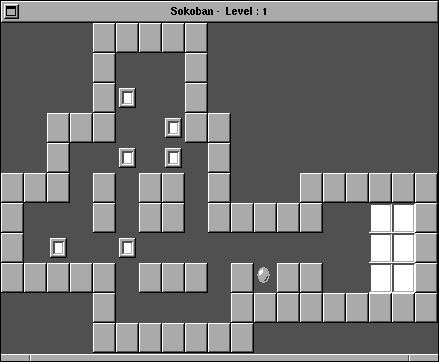

# FastSokoban (1.01)

Historical import reconstructed from the old projects index.

## Details
- Year: 1994
- Environment: NextStep
- Status: Finished

## Description
FastSokoban: Three things let me write this program:
- I played X-Sokoban for half an our.
- I got a nice idea for a pathfnding algorithm
- Sokoban.app on NextStep was unusable slow.

## Original Materials
- Extracted from `1994.FastSokoban.1.01.NIHS.b.tar.gz` into `1994.FastSokoban.1.01.NIHS.b/`
- Extracted from `1994.FastSokoban.1.01.s.tar.gz` into `1994.FastSokoban.1.01.s/`
- Included original file `1994.FastSokoban.icon.jpg`
- Included original file `1994.FastSokoban.screen.jpg`

## Images
### Icon

### Screenshot

